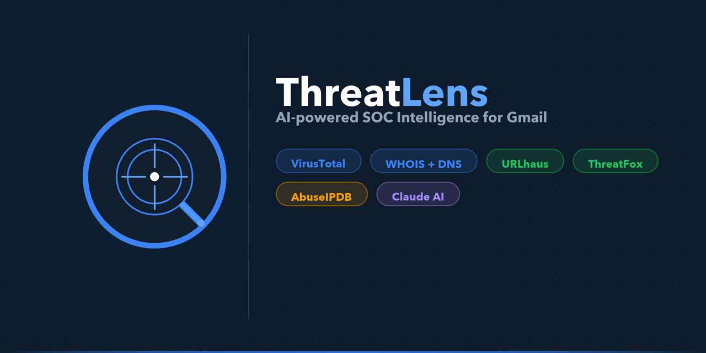

<div align="center">
  
</div>

<br>

> **AI-powered phishing & malware detection for Gmail — built for security-conscious professionals and SOC analysts.**

ThreatLens is a Chrome extension that performs a full SOC-grade threat intelligence scan on any Gmail email in seconds. It combines real-time VirusTotal URL scanning, WHOIS/DNS analysis, IP reputation, and abuse.ch threat feeds with a Claude AI synthesis that produces a plain-English verdict — no security expertise required.

---

## Features

### Chrome Extension
- One-click deep scan of any open Gmail email
- Threat level banner: **SAFE / SUSPICIOUS / MALICIOUS**
- Persistent scan history (last 25 scans survive popup close)
- VT badges overlaid on every embedded link
- Animated SOC intelligence loading steps

### SOC Intelligence (9 checks run in parallel)
| Module | Source | API Key |
|--------|--------|---------|
| URL reputation | VirusTotal v3 | Required |
| WHOIS / domain age | python-whois | None |
| TLS certificate history | crt.sh | None |
| DNS — SPF / DMARC / MX | Google DoH | None |
| GeoIP + proxy detection | ip-api.com | None |
| IP abuse score | AbuseIPDB | Optional |
| Malware URL database | URLhaus (abuse.ch) | None |
| IOC threat feed | ThreatFox (abuse.ch) | None |
| URL sandbox | URLScan.io | Optional |
| Phishing database | PhishTank | None |
| Hash lookup | MalwareBazaar (abuse.ch) | None |

### AI Analysis (Claude claude-sonnet-4-6)
- PII sanitizer strips credit cards, SSNs, passwords, IBANs, and phone numbers from the email body **before** it reaches the model
- Returns structured JSON: threat level, confidence score, 3 key findings, and one recommended action
- Written for non-technical executives — zero jargon

### Email Body Hashes
- MD5 / SHA-1 / SHA-256 computed server-side
- SHA-256 checked against MalwareBazaar automatically

---

## Architecture

```
Gmail Tab                Chrome Extension              FastAPI Backend
─────────────────        ──────────────────────        ─────────────────────────────
content.js               popup.js                      /deep-analyze
  └─ scrapes DOM   ────▶  background.js (cache)  ────▶  VirusTotal  (parallel)
     sender                chrome.storage.local          WHOIS
     subject               scan history                  crt.sh
     body                                                DNS DoH
     links                                               ip-api + AbuseIPDB
                                                         URLhaus + ThreatFox
                                                         PhishTank
                                                         URLScan.io
                                                         MalwareBazaar
                                                         └─ Claude claude-sonnet-4-6
                                                              (PII-sanitized prompt)
```

---

## Quick Start

### 1 — Clone & set up the backend

```bash
git clone https://github.com/Alimddar/ThreatLens.git
cd ThreatLens/server

python3 -m venv venv
source venv/bin/activate          # Windows: venv\Scripts\activate
pip install -r requirements.txt

cp .env.example .env
# Edit .env and add your VIRUS_TOTAL_API_KEY and ANTHROPIC_API_KEY
```

### 2 — Start the server

```bash
uvicorn main:app --reload --port 8000
```

Verify it's running:
```bash
curl http://localhost:8000/health
```

### 3 — Load the Chrome extension

1. Open **chrome://extensions**
2. Enable **Developer mode** (top-right toggle)
3. Click **Load unpacked**
4. Select the `extension/` folder from this repo

### 4 — Scan an email

1. Open **Gmail** in Chrome and open any email
2. Click the ThreatLens icon in the toolbar
3. Click **Deep Scan Email**

---

## Environment Variables

| Variable | Required | Description |
|----------|----------|-------------|
| `VIRUS_TOTAL_API_KEY` | ✅ Yes | VirusTotal API v3 key |
| `ANTHROPIC_API_KEY` | ✅ Yes | Anthropic Claude API key |
| `ABUSEIPDB_API_KEY` | Optional | Enables IP abuse scoring |
| `URLSCAN_API_KEY` | Optional | Enables URLScan.io sandbox submissions |

Copy `server/.env.example` → `server/.env` and fill in your keys. The `.env` file is gitignored and will never be committed.

---

## Privacy & Security

- **Email body is never stored.** It exists in memory only for the duration of the scan.
- **PII is stripped before AI.** A regex sanitizer removes credit card numbers, SSNs, IBANs, passwords, phone numbers, and passport numbers from the email body before it is sent to Claude.
- **Scan history stores no body content** — only sender, subject, threat level, AI summary, and hashes.
- **All API keys live on the server** (`.env`), never in the extension.
- **Scan history** is kept in `chrome.storage.local` (on-device only, never uploaded).

---

## Tech Stack

**Extension** — Manifest V3, Vanilla JS, custom CSS design system (no CDN dependencies — required by MV3 CSP)

**Backend** — Python 3.11+, FastAPI, uvicorn, httpx (async), python-whois, Anthropic SDK

**AI** — Claude claude-sonnet-4-6 (`claude-sonnet-4-6`)

**Threat Intel** — VirusTotal v3, URLhaus, ThreatFox, PhishTank, MalwareBazaar, AbuseIPDB, URLScan.io, ip-api.com, crt.sh, Google DNS-over-HTTPS

---

## Project Structure

```
ThreatLens/
├── extension/              # Chrome MV3 extension
│   ├── manifest.json
│   ├── background.js       # Service worker — message broker + history store
│   ├── content.js          # Gmail DOM scraper
│   ├── popup.html          # Dashboard UI
│   ├── popup.js            # UI logic + SOC section renderers
│   ├── styles.css          # Full custom design system
│   └── icons/              # Extension icons (16/32/48/128 px)
│
└── server/                 # FastAPI backend
    ├── main.py             # All endpoints + intelligence modules
    ├── requirements.txt
    └── .env.example        # Template — copy to .env
```

---

## License

MIT — see [LICENSE](LICENSE).
